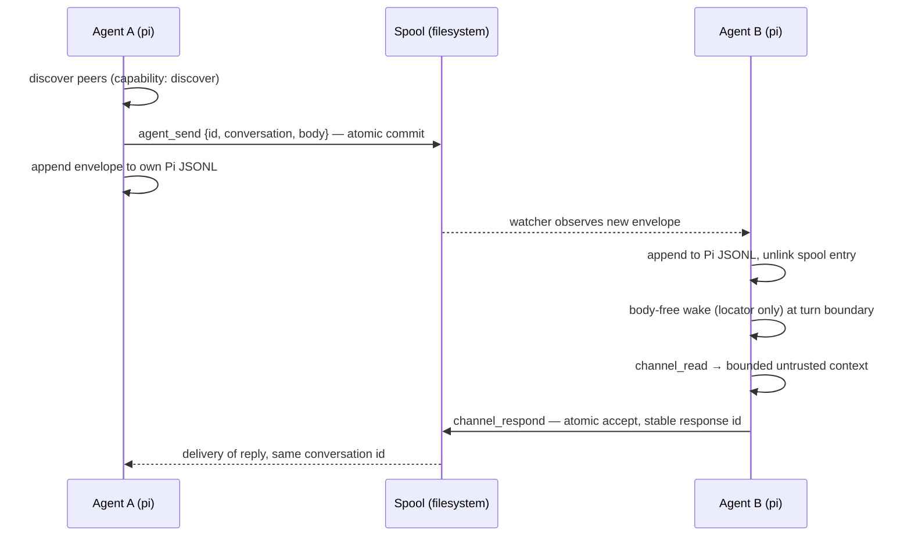
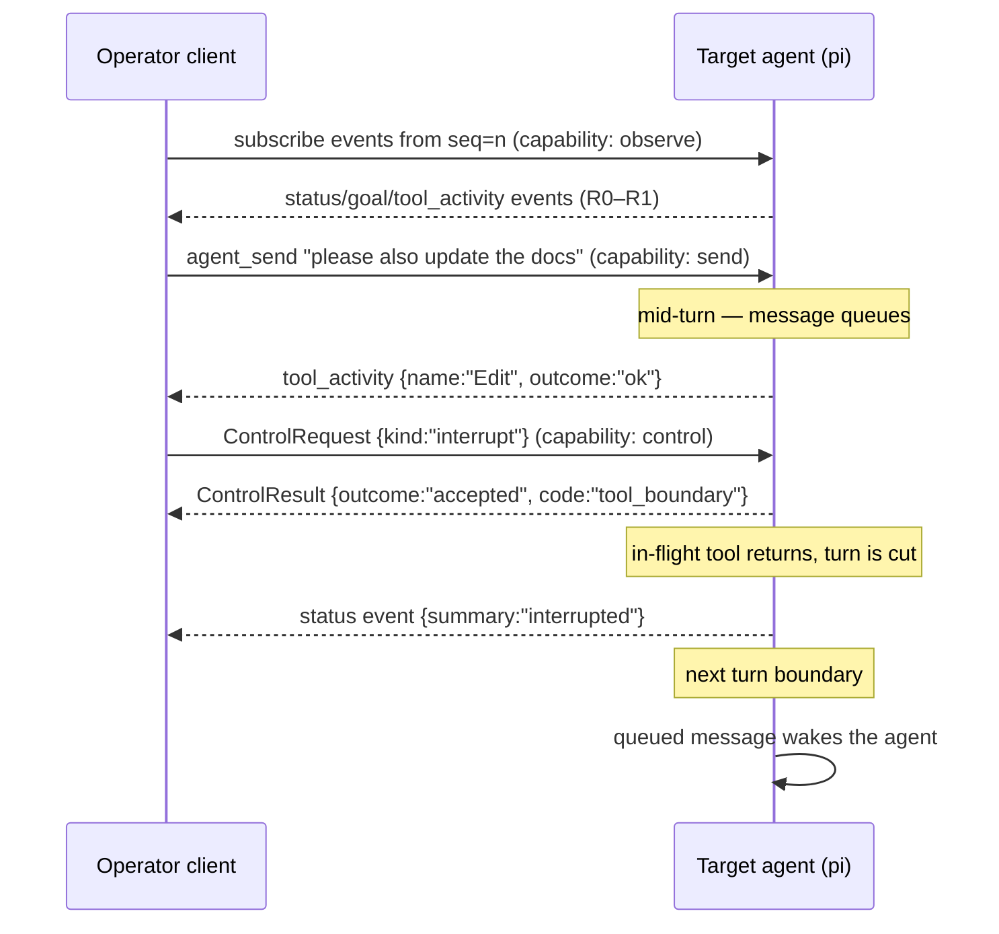
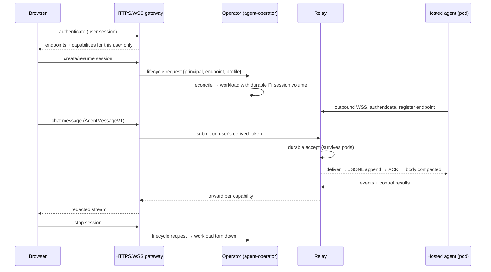
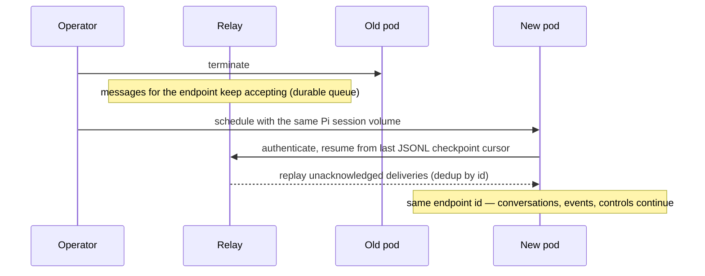

# Agent Session Gateway: use cases and protocol boundaries

This document completes the architecture definition started in
[`agent-session-gateway.md`](./agent-session-gateway.md). That document defines
the shipped chat plane (the `agent` channel and the Channels relay). This one
defines the three target scenarios end-to-end, the shared identity model, the
versioned schemas for the not-yet-implemented observation and control planes,
the ordering and interruption rules, the transport test matrix, and the
security review. Where the two documents overlap, the shipped document wins for
chat-plane behavior.

Terminology, limits, and the chat envelope (`AgentMessageV1`) are inherited
from the shipped document and are not redefined here.

## Shared model

One identity model serves local-only and hosted deployments:

| Object | Definition | Durability |
| --- | --- | --- |
| **principal** | Authenticated user, agent, browser client, or service. The subject of every capability. | Durable; survives everything below. |
| **endpoint** | Addressable running agent/session, owned by exactly one principal. | Durable address; stable across restarts. |
| **Pi session ID** | Durable identity of one agent session's JSONL history. | Durable; the endpoint's canonical state. |
| **conversation ID** | Durable chat thread spanning message exchanges. | Durable; lives in Pi custom entries. |
| **node** | Physical host, VM, container host, or Kubernetes workload identity. | Replaceable at any time. |
| **runtime binding** | The endpoint's current process and mux/container location, held under a lease. | Ephemeral; expires. |
| **group** | Human-facing Zellij/tmux tab set, workspace, or project grouping. | Display metadata only. |

The load-bearing rules:

- Identity flows **principal → endpoint → Pi session ID**. Nodes, runtime
  bindings, and groups are never identity: renaming a tmux pane, replacing a
  pod, or moving a workspace must not change who an agent is or where its
  messages go.
- A **runtime binding** is a lease, not a fact. It is refreshed by heartbeat
  (relay transport) or by spool lease-file touch (filesystem transport) and is
  considered stale after twice the heartbeat interval — the same threshold the
  relay already enforces for connections. Discovery shows at most one live
  binding per endpoint; a stale binding renders as `disconnected`, never as a
  second endpoint.
- Presence states and their signals:

  | State | Signal | Threshold |
  | --- | --- | --- |
  | `online` | live registration/lease | heartbeat within 1× interval |
  | `working` | `online` + a `status` event with an open turn | event-driven |
  | `idle` | `online` + last turn closed | event-driven |
  | `disconnected` | lease missing or expired | > 2× heartbeat interval |
  | `stale` | binding expired but queued state exists | > 2× heartbeat interval |

## Capabilities

Capabilities are defined independently of transport and evaluated wherever a
request enters the system:

```ts
interface CapabilityGrantV1 {
  version: 1;
  principal: string;
  capability: "discover" | "send" | "observe" | "control" | "admin";
  /** Endpoint ids, or "*" where the shipped chat plane already allows it. */
  scope: readonly string[];
}
```

- `discover` — list endpoints and their presence (`list` on the shipped relay);
- `send` — submit chat messages to scoped endpoints (`send:` routes today);
- `observe` — subscribe to a scoped endpoint's redacted session events;
- `control` — submit control requests (interrupt, steer, approve, pause,
  resume, stop) to scoped endpoints;
- `admin` — provision or revoke endpoint identity and credentials.

`observe` and `control` are deliberately **not implied by `send`**. An operator
who can chat with an agent cannot watch its tool activity or interrupt it
without separate grants. `admin` implies nothing else — a provisioning service
needs no ability to read conversations.

How the same grants are represented per trust boundary:

| Boundary | Representation | Authentication |
| --- | --- | --- |
| Same host (spool) | Filesystem ownership and mode on the spool directories; the OS user is the principal. | POSIX identity |
| LAN / Tailscale | The relay credential document, unchanged. Tailscale/Headscale is an optional private network layer underneath TLS — it narrows reachability, but it is never the message queue, the identity store, or a substitute for relay credentials. | Relay bearer credential over TLS |
| Internet (browser) | Short-lived tokens minted by the HTTPS gateway from the same grant model; the relay credential itself never reaches a browser. | Gateway session → derived token |

## Plane schemas

Chat is shipped (`AgentMessageV1`). Observation and control add two envelope
families that reuse the same identifier rules, byte discipline, and versioning
as chat. They share the authenticated WSS connection and the principal /
capability model, and nothing else: separate frame types, separate cursors,
separate storage.

### Session events (observation plane)

```ts
interface SessionEventV1 {
  version: 1;
  /** Per-endpoint monotonic sequence; gaps are detectable, order is total. */
  seq: number;
  endpoint: string;
  at: string; // RFC 3339
  kind: "status" | "goal" | "assistant_message" | "tool_activity";
  /** Bounded, curated payload. Never raw JSONL, never full tool output. */
  payload: {
    /** R1 summary text authored by the publishing extension. */
    summary?: string;
    /** tool_activity only: tool name and terminal outcome. */
    tool?: { name: string; outcome?: "ok" | "error" | "denied" };
    /** assistant_message only: bounded excerpt, R2, opt-in per credential. */
    excerpt?: string;
  };
}
```

The **minimum redacted event stream** — what a viewer needs to see what an
agent is doing — is `status` (online/working/idle plus current turn state),
`goal` (current goal/task title), and `tool_activity` (tool name and outcome).
`assistant_message` excerpts are additive and gated by an explicit per-grant
flag because they can quote untrusted or sensitive content.

Redaction classes, applied at publish time by the producing extension — the
relay and gateway never see the unredacted form:

| Class | Contents | May appear in |
| --- | --- | --- |
| R0 | Structural ids, sequence numbers, timestamps, state names, tool names, outcome codes | Any event, logs, metrics |
| R1 | Curated summaries authored by the agent-side extension (goal titles, status lines), bounded | `summary` fields |
| R2 | Bounded excerpts of assistant text | `excerpt`, only when the observing grant opts in |
| R3 | Credentials, environment values, file contents, command output, tool results, raw Pi JSONL | Never published |

Events are at-least-once with replay from a requested `seq`; consumers dedup by
`(endpoint, seq)`. The producer retains a bounded ring (default: 1,000 events
or 24 h, whichever is smaller); it is telemetry, not history — a gap after
disconnection is reported as a gap, never backfilled from the transcript.

### Control requests and results (control plane)

```ts
interface ControlRequestV1 {
  version: 1;
  id: string; // requester-generated idempotency key
  endpoint: string;
  kind: "interrupt" | "steer" | "approve" | "pause" | "resume" | "stop";
  /** Bounded, kind-specific argument (e.g. steer text, approval id). */
  argument?: string;
}

interface ControlResultV1 {
  version: 1;
  id: string; // echoes the request
  endpoint: string;
  outcome: "accepted" | "deferred" | "rejected" | "failed";
  /** Typed detail code, e.g. "turn_boundary_pending", "not_permitted". */
  code?: string;
  at: string;
}
```

Controls are exactly-once by request `id`: a retry returns the recorded result
and never re-executes. Every request receives a result — `deferred` is a
first-class outcome (the target chose to act at the next safe boundary), not a
timeout. A chat message is never interpreted as a control, and a control never
carries conversational text to the model as if a user sent it; `steer`'s
argument enters the session explicitly labeled as an operator instruction.

## Ordering, queuing, and interruption

Queued delivery is the default everywhere. The shipped chat plane already
implements this: wakes deliver as `followUp`, which starts a turn when the
agent is idle and otherwise runs after the current turn.

Safe delivery boundaries, in order of preference:

1. **turn boundary** — after the current assistant turn completes (the shipped
   `followUp` behavior); the default for chat messages and `steer`;
2. **tool boundary** — after the in-flight tool call returns but before the
   next one is issued; the earliest point `interrupt` may take effect, so a
   tool call's effects are never half-applied;
3. **immediate** — only `stop`, and only as process-level cancellation when the
   operator accepts losing the in-flight turn.

Only `interrupt` and `stop` may cut into a turn; everything else waits for a
turn boundary. Ordering and idempotency guarantees across the planes:

| Sequence | Guarantee |
| --- | --- |
| Queued message during a turn | Delivered at the next turn boundary; never interleaved into the running turn. |
| Multiple queued messages | One wake carrying all pending locators, in `(createdAt, id)` order; at-least-once, deduped by message id. |
| Interrupt during a tool call | Result `accepted` with `code:"tool_boundary"`; takes effect when the tool returns. The tool call itself is never killed mid-flight by `interrupt`. |
| Interrupt vs queued messages | The interrupt wins the boundary; queued messages deliver on the next one. |
| Tool completion vs `pause` | The completing tool's result is journaled first; `pause` lands before the next tool issue. |
| Reconnect (any plane) | Chat resumes from the delivery cursor, events from `seq`, controls by result lookup; each plane's cursor is independent. |
| Duplicate delivery / retry | Chat: dedup by message id. Events: dedup by `(endpoint, seq)`. Controls: recorded result returned, no re-execution. |
| Crash between accept and act | The accepting side recovers to a retry of an already-accepted operation, exactly as the chat state machine defines. |

## State ownership

| State | Owner | Explicitly not |
| --- | --- | --- |
| Conversations, message states, control results | Pi custom JSONL entries (the session itself) | Not the relay, not a second chat database |
| Unacknowledged deliveries, cursors, retry hashes | Relay store (or filesystem spool same-host) | Not conversation history |
| Session-event ring | Producing Pi extension, in memory with bounded spill | Not a durable transcript |
| Desired/observed workload state | Kubernetes operator's API (`agent-operator`) | Not relay presence; a live WSS registration is not "the workload should exist" |
| Credentials and grants | Operator-provisioned documents / gateway auth store | Never in messages, events, or browser storage |

There is **no local daemon**. The spool plus Pi extensions own all same-host
state; introducing a daemon would add a second authority for delivery state
without removing any from the ones above.

## Use case 1 — agents in one multiplexer session

Several Pi agents run in tabs of one Zellij/tmux session. The multiplexer is a
group — display and discovery convenience only.



Failure behavior: an offline recipient's envelopes wait in the spool (bounded
queue, 7-day retention); duplicate wakes re-deliver the same locator and dedup
by message id; a crash between spool commit and JSONL append recovers on the
startup scan as a retry; renaming the tab changes only group metadata; killing
and restarting agent B expires its old runtime lease, and discovery shows the
new binding once its watcher registers. Storage failure (spool unwritable)
fails the send closed — no `accepted` without the atomic commit.

## Use case 2 — local observation, interruption, queued messages

An authorized local operator (human CLI or another agent) watches a target and
occasionally steers it.



Failure behavior: an operator holding only `send` gets `rejected` /
`not_permitted` for the subscribe and the interrupt — chat capability never
implies observation or control; a disconnect and re-subscribe from the last
`seq` either replays from the ring or reports a gap; a duplicate interrupt
(retry) returns the recorded result; events and control results carry the same
endpoint id as the chat messages, so one identity threads all three planes.

## Use case 3 — browser and hosted agents

A browser drives an agent hosted by the Kubernetes operator. The operator is
the lifecycle authority; the relay carries all three planes; the gateway is the
browser's only entry point.



Pod replacement, the failure case that shapes this design:



Failure behavior: the hosted agent needs no inbound port (outbound-only WSS);
queued messages and acknowledgments live in the relay store, outside pods;
message and control ids make retries idempotent across pod restarts, browser
refreshes, and network drops; a browser session receives only derived tokens —
never the relay credential — and only redacted events; raw Pi session files,
credentials, environment data, and unredacted tool output never cross the
gateway. A browser-resident agent is just another principal using the same
chat protocol through the gateway.

## Test matrix

Rows are the scenario families; columns are the transports a conforming
implementation must prove them on. The chat column is largely shipped (see the
verification matrix in the gateway document); observation/control columns bind
the follow-up work.

| Scenario | Local IPC (spool) | LAN / Tailscale (relay, private) | Relay (internet) |
| --- | --- | --- | --- |
| Two-agent chat round trip, both directions | shipped | shipped | shipped |
| Operator starts/continues conversation | shipped | shipped | shipped |
| Offline recipient, queued delivery, replay | shipped | shipped | shipped |
| Duplicate delivery / retry idempotency | shipped | shipped | shipped |
| Authorization failure (route, impersonation) | shipped (fs perms) | shipped | shipped |
| Stale binding: restart re-binds, old lease expires | required | shipped (heartbeat) | shipped |
| Storage failure fails closed, readiness false | shipped | shipped | shipped |
| Event subscribe, replay from seq, gap report | required | required | required |
| Observe denied without `observe` grant | required | required | required |
| Interrupt at tool boundary; deferred result | required | required | required |
| Control retry returns recorded result | required | required | required |
| Pod replacement resumes all planes | n/a | required | required |
| Browser client sees only derived tokens + redacted events | n/a | n/a | required |

## Security review

Threats reviewed against this design; chat-plane rows reference shipped
enforcement, observation/control rows bind the follow-up implementations.

| Threat | Mitigation |
| --- | --- |
| Endpoint impersonation | Registration requires a credential whose `register` list names the endpoint; one credential owner per endpoint is validated at startup; a replacement connection must present the latest cursor (`stale_resume` otherwise). |
| Unauthorized observation | `observe` is a distinct grant; events are published pre-redacted (R0–R2), so even the relay and gateway hold nothing R3; excerpt class requires per-grant opt-in. |
| Unauthorized control | `control` is a distinct grant; every request is authorized per endpoint route; results are attributable and journaled in the target's Pi session. |
| Replay | Chat: idempotency by message id with bounded body-hash retention. Events: monotonic `seq`. Controls: exactly-once by request id. Cursors are server-issued; a client cannot fabricate one it was never issued. |
| Queue abuse / flooding | Bounded per-endpoint queues (1,000), frame budgets split by plane (control vs stream), per-connection rate windows, connection cap with the slot accounting fixed in #21, send backpressure disconnect. |
| Stale bindings | Lease expiry at 2× heartbeat; discovery never shows two live bindings; a stale binding cannot receive, only queue. |
| Sensitive event data | R3 is never published by construction — redaction happens in the producing extension, not downstream; logs carry structural fields only; errors to unauthenticated clients do not reveal principal/endpoint existence. |
| Compromised client | Blast radius is its credential's routes and grants; revocation removes the credential document; nothing durable about other principals is readable through it. |
| Compromised relay | Sees envelopes in transit and unacked bodies at rest (bounded, compacted on ACK); never holds transcripts, credentials-at-rest for browsers, or R3 event data. TLS is fail-closed except explicit loopback development. |
| Compromised network path | TLS required for every non-loopback connection; Tailscale, when used, is defense in depth — not an authentication substitute. |

## Follow-up work

Ownership split — there is no local-daemon component by decision, so the
protocol, relay, and Pi-extension work all land in this repository:

1. **`channels`: observation and control planes** — implement
   `SessionEventV1` / `ControlRequestV1` / `ControlResultV1` frames on the
   existing relay connection, the producing Pi extension (event ring, redaction
   classes, boundary-respecting control handling), the `observe`/`control`
   capability checks, and the "required" rows of the test matrix.
2. **`agent-operator`: hosted lifecycle API** — the create/resume/stop API a
   gateway calls, reconciliation to workloads with durable Pi session volumes,
   and endpoint credential provisioning (tracked in that repository).
3. **`link`: browser client and gateway** — user authentication, derived
   short-lived tokens, capability-filtered endpoint listing, and the redacted
   chat/event/control UI (tracked in that repository).
